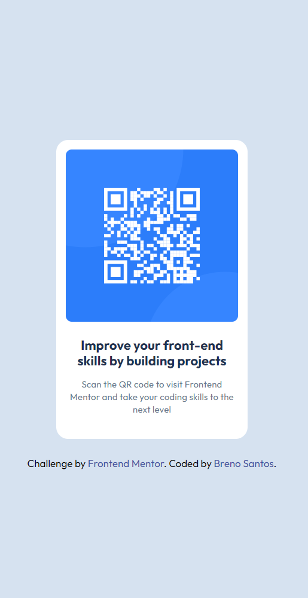

# Frontend Mentor - QR code component solution

This is a solution to the [QR code component challenge on Frontend Mentor](https://www.frontendmentor.io/challenges/qr-code-component-iux_sIO_H). 

## Table of contents

- [Overview](#overview)
  - [Screenshot](#screenshot)
  - [Links](#links)
- [My process](#my-process)
  - [Built with](#built-with)
  - [What I learned](#what-i-learned)
  - [Continued development](#continued-development)
 
- [Author](#author)

## Overview

### Screenshot

### Links

- Solution URL: [https://github.com/breno-santos95/qr-code-component](https://your-solution-url.com)
- Live Site URL: [https://breno-santos95.github.io/qr-code-component/](https://your-live-site-url.com)

## My process

### Built with

- Semantic HTML5 markup
- CSS custom properties
- Flexbox
- CSS Variables
- Figma Design Archive

### What I learned

In this exercise, I aimed to practice writing cleaner code by using variables in CSS and understanding their importance for future code maintenance.

Additionally, practicing Flexbox is always welcome, as it brings greater awareness of its usage, proving to be an extremely important tool in a developer's toolkit.

In this project, I also consolidated my code versioning skills through GitHub, building on previous knowledge.

Becoming more familiar with Figma files also brought more fluency in using the tool.

### Continued development

I want to continue developing my skills with Flexbox, code versioning with Git/GitHub, and clean code practices.

I want to deepen my knowledge of code refactoring, understanding its importance for code fluidity, speed, and size.

## Author

- Website - [https://github.com/breno-santos95](https://www.your-site.com)
- Frontend Mentor - [https://www.frontendmentor.io/profile/breno-santos95](https://www.frontendmentor.io/profile/yourusername)

